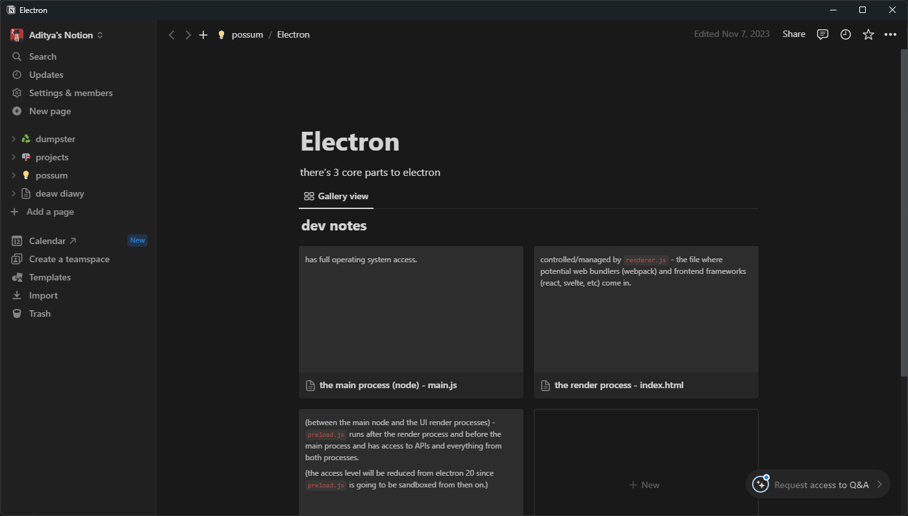
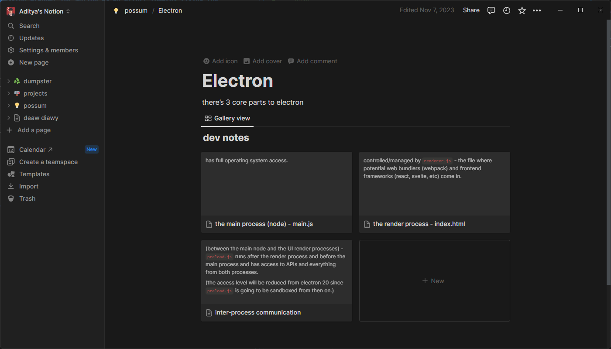

# BetterNotion

### An Electron based Desktop Wrapper for Notion as an effort towards fixing the ugly titlebars on the default official Notion app.

The motive behind creating this was to simply have a better looking desktop app for Notion which is a great tool and an important part of my productivity stack. The titlebar was one thing that spoiled the overall look of the app on desktop. Especially compared to the [MacOS app](https://www.notion.so/cdn-cgi/image/format=webp,width=3840/https://images.ctfassets.net/spoqsaf9291f/4mXsX9OTg76DoIVev9gyfp/66f4b19496ecd8625be9b10812ba3e21/downloads-hero-mac.png), the Windows app sucks (it's just the way the overall app blends into the titlebar).

| Official Notion Desktop App                                           | BetterNotion                                         |
| --------------------------------------------------------------------- | ---------------------------------------------------- |
|  |  |

BetterNotion is simply an desktop app which simply renders the notion website inside a webview, built with electron. The UI changes are done by injecting custom CSS.

BetterNotion makes the following UI changes:    
- remove default window titlebar.
- change font to Inter.
- make UI adjustments to fix side effects caused from removing the titlebar.
